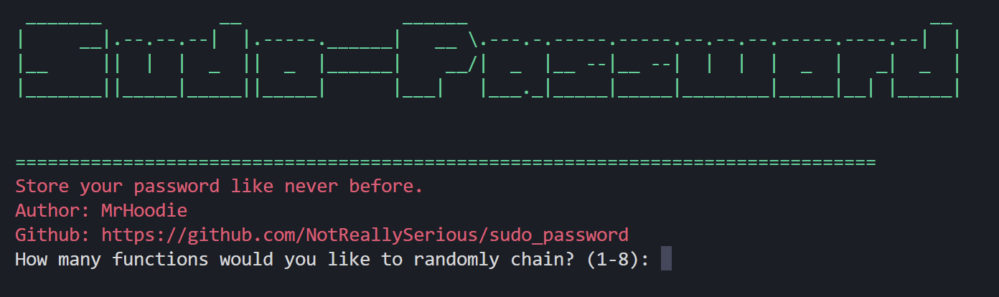

# SUDO PASSWORD




Having trust issues with password managers? *Sudo Password* is the solution for you. This tool helps you to store password locally as a text inside your own device. Either Windows, Linux, or MacOS. This tool combines multiple encoding algorithms to anonymize your password. Make it highly difficult for hackers to crack the password. 

This tool is best use to craft password for sensitive files or accounts. 

# Important Note
Dont use short and guesable passwords to prevent bruteforce attacks. use 12 characters long, and use special characters (? , . _ ` ) and numbers to strenghten your password. Dont forget to store them into a file to save your password.

# Installation Tutorial
1. Clone the Repo
```python
git clone https://github.com/NotReallySerious/Sudo_Password
```
2. Install The Requirements
```python
pip install -r requirements.txt
```
3. Run the tool
```python
python main.py
```

  
